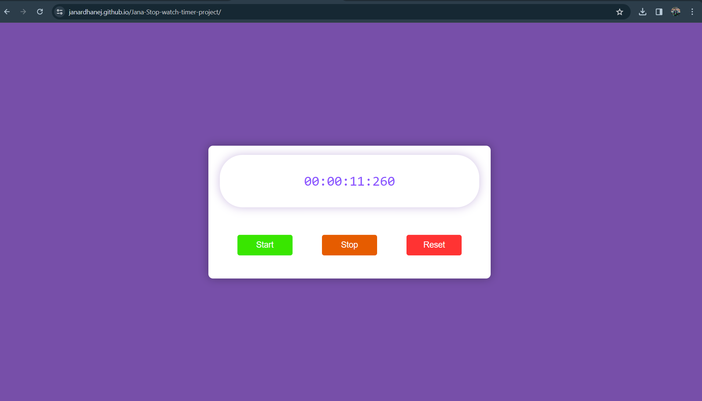

### **Stopwatch Timer Application Project**

This is a simple Stop watch Timer application built using HTML, CSS and JavaScript. The app allows users to start, stop, and reset the timer.

### **Features:**

1. Start: Starts the timer.
2. Stop: Stops the timer.
3. Reset: Resets the timer to 0.

### **How to Use:**

1. Clone the repository: git clone https://github.com/JanardhanEJ/janardhanej1906-stop-timer-watch-project.git
2. Open home.html in your web browser. Use Start/Stop/Reset button according to the user requirements.

### **Screenshots**

1. while opening home.html file, you will see web page as below:

   

2. click on start/stop or reset button according to the requirements of the User. Below is the sample screenshot of timer running.
   

### **Live Demo**

Link: https://janardhanej.github.io/janardhanej1906-stop-watch-timer-project/
